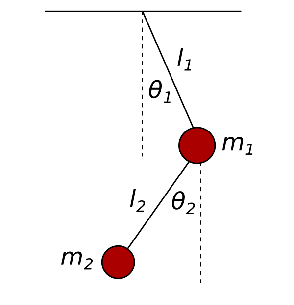

## System Overview

### Double Pendulum
A chaotic and nonlinear dynamical system that is sensitive to initial conditions. The double pendulum serves as an excellent benchmark for testing how well the models can predict chaotic motion.



### Lorenz Attractor
A system that exhibits chaotic behavior, often used as a model for atmospheric convection. We compare how the models capture the system’s highly nonlinear dynamics.


### Domain Wall Problem
A physical problem in spintronics, where we explore the movement of domain walls in magnetic materials. Neural ODEs are tested against conventional neural networks in this context.


## Key Models Implemented

1. **Recurrent Neural Networks (RNNs)**:
   - Traditional RNNs used for sequential data prediction.
   - Known for capturing temporal dependencies but limited in handling long-range dependencies.

2. **Long Short-Term Memory Networks (LSTMs)**:
   - An extension of RNNs, LSTMs address issues of vanishing gradients and are better at capturing long-term dependencies.

3. **Neural Ordinary Differential Equations (Neural ODEs)**:
   - A continuous-time model that uses a differential equation to model system dynamics.
   - Neural ODEs are flexible in representing complex, continuous, and chaotic systems.

## Installation

To get started, clone this repository and install the necessary dependencies:

```bash
git clone https://github.com/JagpreetJakhar/Dissertation.git
cd Dissertation
pip install -r requirements.txt
