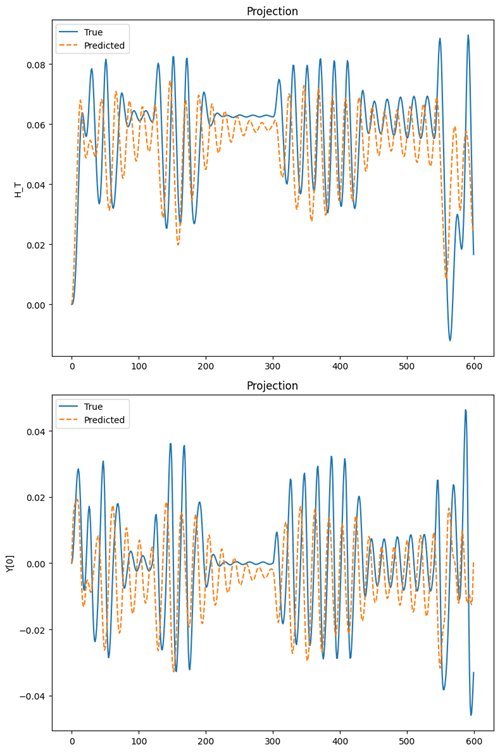

# Neural ODEs for Physical Systems

This repository contains the code and resources for an MSc dissertation under supervision of [**Dr Matt Ellis**](https://www.sheffield.ac.uk/cs/people/academic/matt-ellis) in The University of Sheffeild. The application of Neural Ordinary Differential Equations (NODEs) to model complex physical systems is evaluated. The study focuses on three distinct physical systems: **the double pendulum, the Lorenz attractor, and the magnetic domain wall problem.** The objective is to investigate and compare the predictive performance of Recurrent Neural Networks (RNNs), Long Short-Term Memory networks (LSTMs), and Neural ODEs.

---


## Key Concepts

- **Neural Ordinary Differential Equations (NODEs)**: A neural network architecture that parameterizes the derivative of a system's state, enabling continuous-time modeling with ODE solvers popularised by Ricky TQ Chen in the paper [**Neural Ordinary Differential Equations**](https://arxiv.org/abs/1806.07366).
  
  

- **Chaotic Systems**: Dynamical systems with **sensitive dependence on initial conditions**, such as the double pendulum and the Lorenz attractor.
- **Recurrent Neural Networks (RNNs)**: Sequential models using hidden states to maintain memory over time.
- **Long Short-Term Memory Networks (LSTMs)**: Enhanced RNNs that use gating mechanisms to overcome vanishing gradient issues.
- **Adjoint Method**: An efficient backpropagation method for Neural ODEs that saves memory and ensures numerical stability.
- **ODE Solvers**: Numerical methods like Euler’s method, RK4, and Dormand-Prince (DOPRI5) to approximate ODE solutions.

---
## Methodology

*   A **Multilayer Perceptron** is parameterized using the Neural ODE in all problems.
*   **Torchdiffeq**, an ODE solver library for PyTorch, is used as a blackbox ODE solver with support for Adjoint-based backpropagation.
*   Different **batch sizes and activation functions** were used depending on the problem, including ReLU for the Lorenz problem, LeakyRelu for the Double Pendulum problem, and a combination of LeakyReLu and tanh for the domain wall problem.
* Different Loss Functions were also used for the problems, Huber Loss was able to perform better than MSE for Domain Wall Problem.
*   Evaluation was done based on **forecasting ability** and **generalization ability** .


## Experiments

### Double Pendulum

<div style="display: flex; justify-content: center; gap: 10px;">
<div style="display: flex; flex-direction: column; justify-content: left;">
    <p><b>Data Generation:</b> The data for the Double Pendulum problem is created using ten random initial conditions and then using the torchdiffeq odeint solver to generate the data.</p>
<p>Then three model architectures are trained and tested on this data, namely a vanilla
 Recurrent Neural Network(RNN), a vanilla Long Short Term Memory RNN (LSTM), which
 are used as a baseline to compare against the performance of the final NODE model. Mean
 Squared Error is used as the metric along with vector fields of the predictions made by the
 models to draw analysis and conclusions</p>
  </div>
  <div>
    
    <p align="center"><b>Double Pendulum:</b> A classic example of a chaotic system. Models predict the angles and angular velocities of the pendulum arms.</p>
  </div>
  
</div>


### Lorenz Attractor
<div style="display: flex; justify-content: left; gap: 20px;">
<div style="display: flex; flex-direction: column; justify-content: left;">
    <p><b>Data Generation:</b> The data for the Double Pendulum problem is created using ten random initial conditions and then using the torchdiffeq odeint solver to generate the data.</p>
<p>Then three model architectures are trained and tested on this data, namely a vanilla
 Recurrent Neural Network(RNN), a vanilla Long Short Term Memory RNN (LSTM), which
 are used as a baseline to compare against the performance of the final NODE model. Mean
 Squared Error is used as the metric along with vector fields of the predictions made by the
 models to draw analysis and conclusions</p>
  </div>
  <div>
    
    <p align="center"><b>Lorenz Attractor:</b> A well-known chaotic system in atmospheric science. Models predict the evolution of state variables over time.</p>
  </div>
</div>

### Magnetic Domain Wall Dynamics

<div style="display: flex; justify-content: center; gap: 20px;">
  <div>
    
    <p align="center"><b>Domain Wall 1:</b> Dynamics of a domain wall placed between two anti-notches of nickel nanowire under oscillating magnetic fields.</p>
  </div>
  <div>
    
    <p align="center"><b>Domain Wall 2:</b> Continuation of dynamics under varying field intensities.</p>
  </div>
</div>

---

## Results

The models are analyzed by their performance on the
 three test sets one by one using **Error Metrics**, **visualizations** and **Vector Fields**.

### Lorenz Attractor Vector Fields
<div style="display: flex; justify-content: center; gap: 20px;">
  <figure>
    
    <figcaption>LSTM Vector Field Lorenz</figcaption>
  </figure>
  <figure>
    
    <figcaption>RNN Vector Field Lorenz</figcaption>
  </figure>
  <figure>
    
    <figcaption>NODE Vector Field Lorenz</figcaption>
  </figure>
</div>

### Double Pendulum Vector Fields
<div style="display: flex; justify-content: center; gap: 20px;">
  <figure>
    
    <figcaption>DP Vector Field RNN</figcaption>
  </figure>
  <figure>
    
    <figcaption>DP Vector Field LSTM</figcaption>
  </figure>
  <figure>
    
    <figcaption>DP Vector Field NODE</figcaption>
  </figure>
</div>

### Domain Wall Dynamics (Single Field vs. Multiple Fields)

<div style="display: flex; justify-content: center; gap: 20px;">
  <figure>
    
    <figcaption>Single Field Domain Wall</figcaption>
  </figure>
  <figure>
    
    <figcaption>Single Field Domain Wall Predicted Vector Field</figcaption>
  </figure>
</div>
<br>
<div style="display: flex; justify-content: center; gap: 20px;">
  <figure>
    
    <figcaption>Multiple Field Domain Wall</figcaption>
  </figure>
  <figure>
    
    <figcaption>Multiple Field Domain Wall Predicted Vector Field</figcaption>
  </figure>
</div>

<br>

<div style="display: flex; justify-content: center; gap: 20px;">
  <figure>
    
    <figcaption>NODE Single Field predictions</figcaption>
  </figure>
  <figure>
    
    <figcaption>NODE Multiple Field Predictions</figcaption>
  </figure>
</div>

**Key Observations:**
- Neural ODEs are a significant improvement over RNNs and LSTMs for modeling dynamical and chaotic systems over long time horizons. However, they are still far from accurately simulating these systems.
- Neural ODEs as an architecture have inherent limitations, which restrict the functions they can learn or represent i.e. they are not universal approximations.
- NODEs struggle to learn the dynamics of the domain wall, despite the fact that these are coupled first-order differential equations, which they should theoretically be able to learn.

---

## Future Work
1. **Augmented Neural ODEs (ANODEs):** Improve NODEs by increasing the dimensions of the state space.
2. **Second-Order Neural ODEs (SONODEs):** Better suited for systems with inherent second-order dynamics.
3. **Hamiltonian Neural Networks (HNNs):** Enforce conservation laws for physical interpretability.
4. **Lagrangian Neural Networks:** Use Lagrangian mechanics for energy conservation in modeling chaotic systems.

---

## Getting Started

1. Clone the repository:
   ```bash
   git clone https://github.com/JagpreetJakhar/Dissertation

2. Install the required libraires:
    ```
    pip install -r requirements.txt

    ```
3. Run Code for the three problems from their  Folder names:
    - Navigate to the `Double_Pendulum` folder and run the following files for each model:
        - `pendulum_rnn.ipynb`: Implementation of RNN for the double pendulum.
        - `pendulum_LSTM.ipynb`: Implementation of LSTM for the double pendulum.
        - `pendulum_NODE.ipynb`: Implementation of NODE for the double pendulum.
        

    - Navigate to the `Lorenz` folder and run the following scripts for each model:
        - `lorenz_rnn.ipynb`: Implementation of RNN for the Lorenz attractor.
        - `lorenz_lstm.ipynb`: Implementation of LSTM for the Lorenz attractor.
        - `lorenz_node.ipynb`: Implementation of NODE for the Lorenz attractor.
        
    - Navigate to the `Domain_Wall` folder and run the following scripts:
        - `single_field_node.ipynb`: NODE implementation for the domain wall under a single field.
        - `multiple_fields_node.ipynb`: NODE implementation for the domain wall under multiple fields.