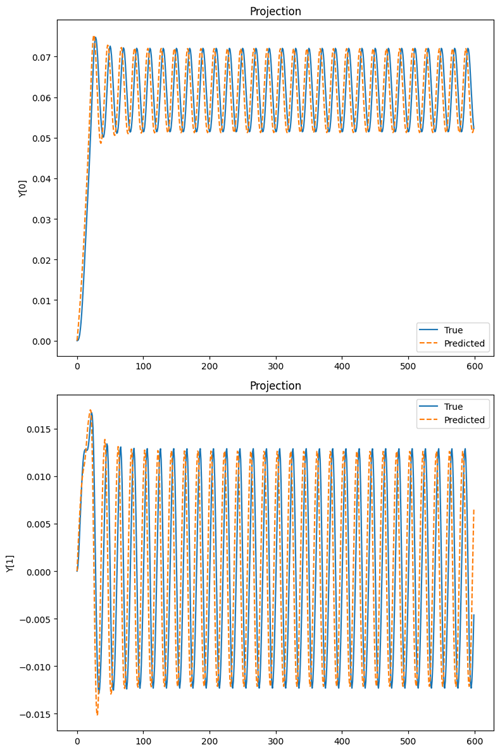

# Neural ODEs for Physical Systems

This repository contains the code and resources for an MSc dissertation under supervision of [**Dr Matt Ellis**](https://www.sheffield.ac.uk/cs/people/academic/matt-ellis) in The University of Sheffeild. The application of Neural Ordinary Differential Equations (NODEs) to model complex physical systems is evaluated. The study focuses on three distinct physical systems: **the double pendulum, the Lorenz attractor, and the magnetic domain wall problem.** The objective is to investigate and compare the predictive performance of Recurrent Neural Networks (RNNs), Long Short-Term Memory networks (LSTMs), and Neural ODEs.

---


## Key Concepts

- **Neural Ordinary Differential Equations (NODEs)**: A neural network architecture that parameterizes the derivative of a system's state, enabling continuous-time modeling with ODE solvers popularised by Ricky TQ Chen in the paper [**Neural Ordinary Differential Equations**](https://arxiv.org/abs/1806.07366).
  
  

- **Chaotic Systems**: Dynamical systems with **sensitive dependence on initial conditions**, such as the double pendulum and the Lorenz attractor.
- **Recurrent Neural Networks (RNNs)**: Sequential models using hidden states to maintain memory over time.
- **Long Short-Term Memory Networks (LSTMs)**: Enhanced RNNs that use gating mechanisms to overcome vanishing gradient issues.
- **Adjoint Method**: An efficient backpropagation method for Neural ODEs that saves memory and ensures numerical stability.
- **ODE Solvers**: Numerical methods like Euler’s method, RK4, and Dormand-Prince (DOPRI5) to approximate ODE solutions.

---
## Methodology

*   A **Multilayer Perceptron** is parameterized using the Neural ODE in all problems.
*   **Torchdiffeq**, an ODE solver library for PyTorch, is used as a blackbox ODE solver with support for Adjoint-based backpropagation.
*   Different **batch sizes and activation functions** were used depending on the problem, including ReLU for the Lorenz problem, LeakyRelu for the Double Pendulum problem, and a combination of LeakyReLu and tanh for the domain wall problem.
* Different Loss Functions were also used for the problems, Huber Loss was able to perform better than MSE for Domain Wall Problem.
*   Evaluation was done based on **forecasting ability** and **generalization ability** .


## Experiments

### Double Pendulum

<div style="display: flex; justify-content: center; gap: 10px;">
<div style="display: flex; flex-direction: column; justify-content: left;">
    <p><b>Data Generation:</b> The data for the Double Pendulum problem is created using ten random initial conditions and then using the torchdiffeq odeint solver to generate the data.</p>
<p>Then three model architectures are trained and tested on this data, namely a vanilla
 Recurrent Neural Network(RNN), a vanilla Long Short Term Memory RNN (LSTM), which
 are used as a baseline to compare against the performance of the final NODE model. Mean
 Squared Error is used as the metric along with vector fields of the predictions made by the
 models to draw analysis and conclusions</p>
  </div>
  <div>
    
    <p align="center"><b>Double Pendulum:</b> A classic example of a chaotic system. Models predict the angles and angular velocities of the pendulum arms.</p>
  </div>
  
</div>


### Lorenz Attractor
<div style="display: flex; justify-content: left; gap: 20px;">
<div style="display: flex; flex-direction: column; justify-content: left;">
    <p><b>Data Generation:</b>  The dataset for Lorenz attractor is made by using ten random initial points within a range
 of 15 to -15 which cause the attractor to behave chaotically, displaying the butterfly-like
 effect when plotted. The dataset is divided into with first six points as the training set, the
 seventh point as the validation set, and the last three as the test set, an approach similar to
 that of the double pendulum considered previously</p>
<p>TNow, the three models are trained on the training data, Mean Squared Error, Visualisation,
 and Vector Fields and evaluated to compare the three models. The abilities of the model
 being evaluated are Forecasting Ability and Generalizability.</p>
  </div>
  <div>
    
    <p align="center"><b>Lorenz Attractor:</b> A well-known chaotic system in atmospheric science. Models predict the evolution of state variables over time.</p>
  </div>
</div>

### Magnetic Domain Wall Dynamics

<div style="display: flex; justify-content: center; gap: 20px; align-items: flex-start; flex-wrap: wrap;">
  <div style="display: flex; flex-direction: column; justify-content: left; gap: 15px; max-width: 50%; flex: 1;">
    <p><b>Data Generation:</b> The Magnetic Domain Wall dynamics are simulated using ‘DW oscillator.py’. The class is initialized with various physical parameters, including:</p>
    <ul>
      <li>Magnetic saturation moment (Ms)</li>
      <li>Exchange stiffness constant (A)</li>
      <li>Gilbert damping coefficient (α)</li>
      <li>Dimensions of the magnetic system (L)</li>
      <li>Anisotropy constants (a and b)</li>
      <li>External magnetic field amplitude (hconst)</li>
      <li>Oscillation frequency (f set to 0.5)</li>
      <li>Time-dependent external magnetic field (htime)</li>
    </ul>
    <p>The function <b>run_field_sequence (RFD)</b> takes the input range of fields (low, high), the number of fields to be generated, the duration of each field, initial domain wall position, and angle to generate and simulate the set of fields randomly within that range. It returns the domain wall position, angle, and input sequence upon which the NODE is trained.
    </p>
    <p> The external magnetic field, which serves as the oscillating input field to the domain wall, is also used by calculating its gradient using a function sequence. This gradient is attached in the forward pass of the Multilayer Perceptron to always have the correct driving force. </p>
    <p><b>ODE-Solver:</b> The ODE-solver parametrizes a 5-layer MultiLayer Perceptron, which takes an input of size three and outputs two values: the predicted Domain Wall Position and Angle. The data simulated by the RFD function is first normalized to the range [-1, 1], as the domain wall position initially is at a different scale than the angles, which are in radians. These are then stacked together to form the data along with the time given by the RFD function.</p>
    <p>This data is then fed to the ODE Solver using the adjoint method and Dormand-Prince solver (dopri5) to make a prediction on the domain wall position and angle using the initial position and time steps selected randomly from the data using a get batch function. The Huber Loss function is used over the Mean Squared Error Loss function, as it gives better results when training. Once the prediction error is calculated, backpropagation of error signals is done using the Adjoint method.</p>
    <p><b>Optimization:</b> The trained model is tested on a set containing randomly generated fields by the RFD function. The AdamW optimizer, a modification of the Adam optimizer, is used, which decouples weight decay from the gradient update.</p>
  </div>

  <div style="display: flex; flex-direction: column; gap: 15px; max-width: 50%; flex: 1;">
    <div>
      
      <p align="center"><b>Domain Wall 1:</b> Dynamics of a domain wall placed between two anti-notches of nickel nanowire under oscillating magnetic fields.</p>
    </div>
    <div>
      
      <p align="center"><b>Domain Wall 2:</b> Continuation of dynamics under varying field intensities.</p>
    </div>
  </div>
</div>


---

## Results

The models are analyzed by their performance on the
 three test sets one by one using **Error Metrics**, **visualizations** and **Vector Fields**.

### Lorenz Attractor Vector Fields
<div style="display: flex; justify-content: center; gap: 20px; flex-wrap: wrap;">
  <figure style="flex: 1 1 30%; max-width: 300px; text-align: center;">
    
    <figcaption>LSTM Vector Field Lorenz</figcaption>
  </figure>
  <figure style="flex: 1 1 30%; max-width: 300px; text-align: center;">
    
    <figcaption>RNN Vector Field Lorenz</figcaption>
  </figure>
  <figure style="flex: 1 1 30%; max-width: 300px; text-align: center;">
    
    <figcaption>NODE Vector Field Lorenz</figcaption>
  </figure>
</div>

### Double Pendulum Vector Fields
<div style="display: flex; justify-content: center; gap: 20px;">
  <figure>
    
    <figcaption>DP Vector Field RNN</figcaption>
  </figure>
  <figure>
    
    <figcaption>DP Vector Field LSTM</figcaption>
  </figure>
  <figure>
    
    <figcaption>DP Vector Field NODE</figcaption>
  </figure>
</div>

### Domain Wall Dynamics (Single Field vs. Multiple Fields)

<div style="display: flex; justify-content: center; gap: 20px;">
  <figure>
    
    <figcaption>Single Field Domain Wall</figcaption>
  </figure>
  <figure>
    
    <figcaption>Single Field Domain Wall Predicted Vector Field</figcaption>
  </figure>
</div>
<br>
<div style="display: flex; justify-content: center; gap: 20px;">
  <figure>
    
    <figcaption>Multiple Field Domain Wall</figcaption>
  </figure>
  <figure>
    
    <figcaption>Multiple Field Domain Wall Predicted Vector Field</figcaption>
  </figure>
</div>

<br>

<div style="display: flex; justify-content: center; gap: 20px;">
  <figure>
    
    <figcaption>NODE Single Field predictions</figcaption>
  </figure>
  <figure>
    
    <figcaption>NODE Multiple Field Predictions</figcaption>
  </figure>
</div>

**Key Observations:**
- Neural ODEs are a significant improvement over RNNs and LSTMs for modeling dynamical and chaotic systems over long time horizons. However, they are still far from accurately simulating these systems.
- Neural ODEs as an architecture have inherent limitations, which restrict the functions they can learn or represent i.e. they are not universal approximations.
- NODEs struggle to learn the dynamics of the domain wall, despite the fact that these are coupled first-order differential equations, which they should theoretically be able to learn.

---

## Future Work
1. **Augmented Neural ODEs (ANODEs):** Improve NODEs by increasing the dimensions of the state space.
2. **Second-Order Neural ODEs (SONODEs):** Better suited for systems with inherent second-order dynamics.
3. **Hamiltonian Neural Networks (HNNs):** Enforce conservation laws for physical interpretability.
4. **Lagrangian Neural Networks:** Use Lagrangian mechanics for energy conservation in modeling chaotic systems.

---
<!-- Acknowledgements Section -->
## Acknowledgements
### Special thanks to:

- [**Dr Matt Ellis**](https://www.sheffield.ac.uk/cs/people/academic/matt-ellis), for his Guidance and Supervision throughout my dissertation journey.
- I would like to thank [**Patrick Kidger**](https://kidger.site/) for his very helpful Phd theses [On Neural Differential Equations](https://arxiv.org/abs/2202.02435) and his implementation of torchdiffeq library.

- [**Alexander Norcliffe**](https://github.com/a-norcliffe), who helped out by pointing out the defeciencies in using First Order Neural ODEs for the Domain Wall Problem and suggested the approach of using Second Order Neural ODEs.

## Getting Started

1. Clone the repository:
   ```bash
   git clone https://github.com/JagpreetJakhar/Dissertation

2. Install the required libraires:
    ```
    pip install -r requirements.txt

    ```
3. Run Code for the three problems from their  Folder names:
    - Navigate to the `Double_Pendulum` folder and run the following files for each model:
        - `pendulum_rnn.ipynb`: Implementation of RNN for the double pendulum.
        - `pendulum_LSTM.ipynb`: Implementation of LSTM for the double pendulum.
        - `pendulum_NODE.ipynb`: Implementation of NODE for the double pendulum.
        

    - Navigate to the `Lorenz` folder and run the following scripts for each model:
        - `lorenz_rnn.ipynb`: Implementation of RNN for the Lorenz attractor.
        - `lorenz_lstm.ipynb`: Implementation of LSTM for the Lorenz attractor.
        - `lorenz_node.ipynb`: Implementation of NODE for the Lorenz attractor.
        
    - Navigate to the `Domain_Wall` folder and run the following scripts:
        - `single_field_node.ipynb`: NODE implementation for the domain wall under a single field.
        - `multiple_fields_node.ipynb`: NODE implementation for the domain wall under multiple fields.